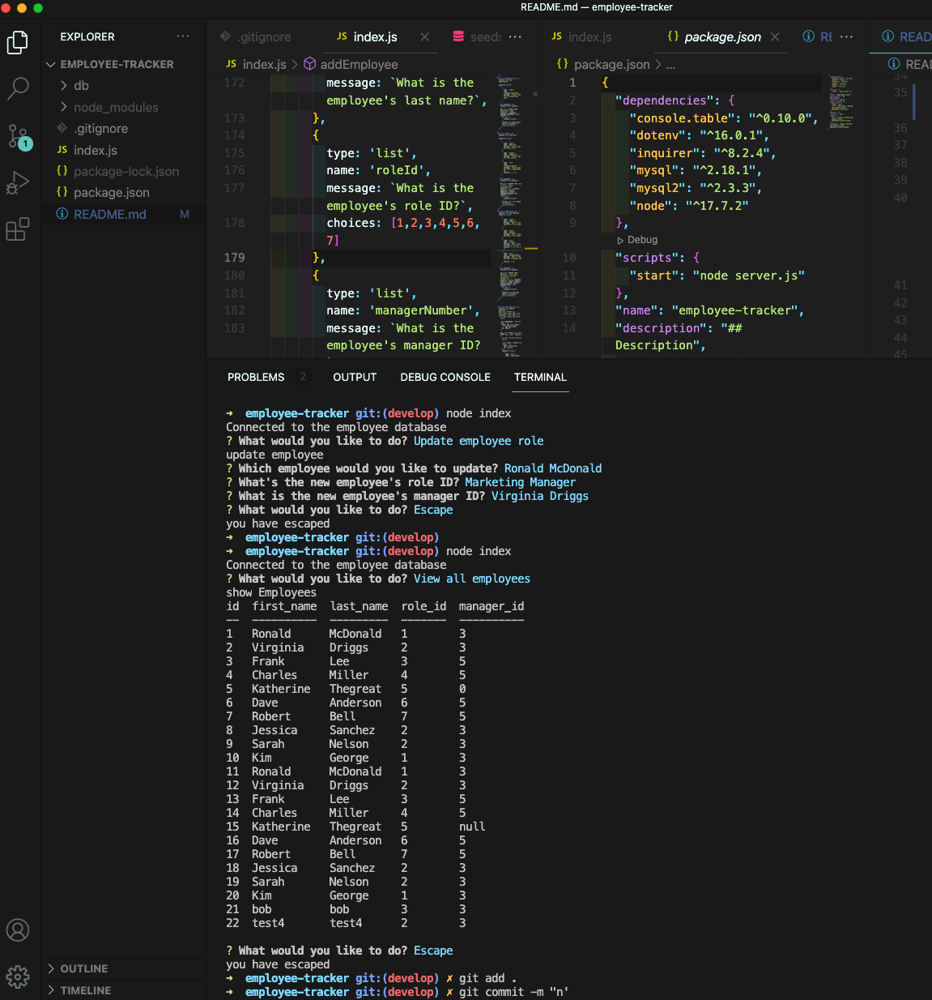

# employee-tracker

## Description

The purpose of this project to create an employee tracker that the user can go inside and update and add items into the tracker.

## Table of Contents

- [Installation](#installation)
- [Usage](#usage)
- [Function](#function)
- [License](#license)

## Installation

You can install this by opening up the page on GitHub and cloning it to your computer using bash or terminal. Once cloned it can be opened up on VS Code.

Please see video link for a walk through on how to clone it.

[Clone to your computer](https://drive.google.com/file/d/15ogCY3Q-JLWhteoSiIoXLkhtK4Z0-mfz/view?usp=sharing "Click Me!")
  

Once cloned you can download the following:
* `npm init`
* `npm i console.table dotenv inquirer mysql2 node`

## Usage

After you have cloned the repo to your computer and downloaded its dependencies you can run `node index` in the terminal. Then you will see the prompts that you can answer. 

The answers will load and be updated to the database.

## License

---

## Tests

To test this application run { npm test } in bash

## Contact Me

Github: jamesfillerup
james@fillerupdev.com

